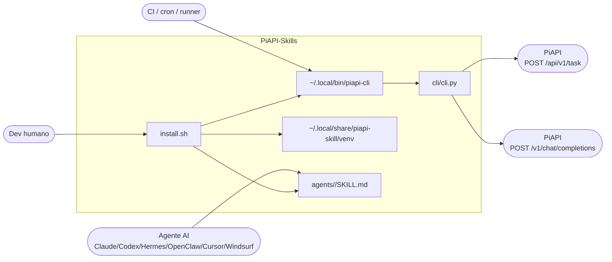
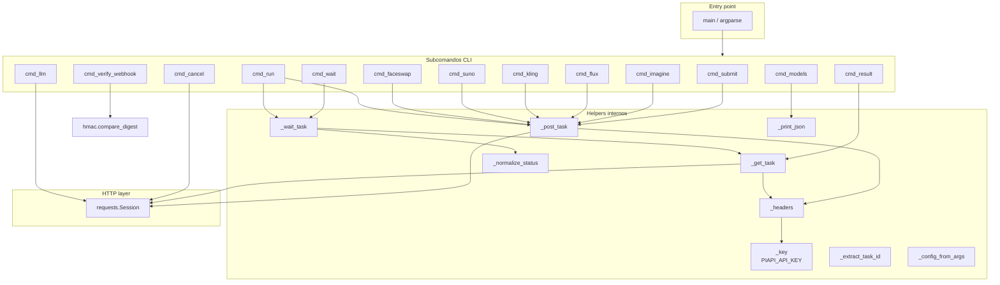
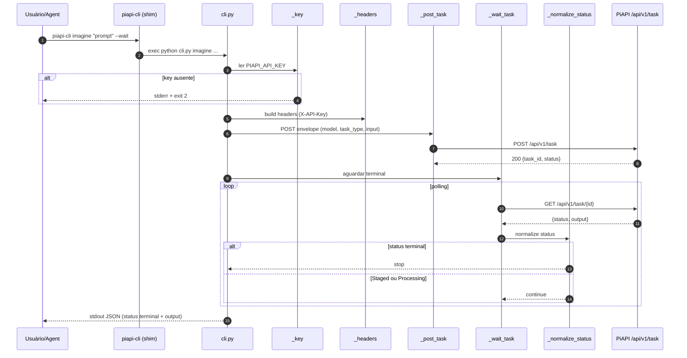

# Design — `PiAPI-Skills`

> Visão da arquitetura. Decisões pontuais ficam em ADRs.
> Audiência: dev humano e agente AI consumindo o repo.

---

## 1. Contexto de sistema

Quem fala com quem.

Notas:
- `install.sh` é o único ponto de provisionamento. Idempotente.
- `shim` é shell wrapper; ativa `venv` e exec `python cli.py`.
- `cli/cli.py` é single-file. Stdlib + `requests`.
- `skills` é texto markdown — o agente AI lê, não executa.
- PiAPI tem dois endpoints distintos: async (`/api/v1/task`) e LLM gateway OpenAI-compat (`/v1/chat/completions`).

---

## 2. Componentes (zoom)

Princípio: `_key`/`_headers`/`_post_task`/`_get_task`/`_wait_task`/`_normalize_status` são pontos únicos. Subcomandos não duplicam lógica.

---

## 3. Boundaries

| Boundary | Responsabilidade | Regra |
|----------|------------------|-------|
| `install.sh` | Provisionar venv, instalar deps, criar shim, copiar SKILL.md por host | Idempotente. Suporta `--yes`, `--uninstall`, `--agents`. Usa `uv` se disponível. |
| `piapi-cli` (shim) | Ativar venv e `exec python cli.py "$@"` | Sem lógica. Trampolim puro. |
| `cli/cli.py` | Parse de args, montagem de envelope, chamada HTTP, normalização de status | Stdlib + `requests`. Sem framework. Sem cache. Sem retry exponencial. |
| `agents/<host>/SKILL.md` | Documentar para o host AI o que/como chamar | Markdown. Não executa nada. Atualiza junto com `cli.py`. |
| `.github/workflows/*.yml` | Lint (ruff + py_compile + shellcheck + markdown links) e smoke matrix de install | CI bloqueia merge em vermelho. |

Cruzar boundary errado = anti-pattern. Skill não chama HTTP. CLI não escreve em disco fora de stdout. `install.sh` não lê `PIAPI_API_KEY`.

---

## 4. Stack

| Camada | Tecnologia |
|--------|------------|
| Linguagem | Python 3.10+ (declarado em `pyproject.toml` `target-version = "py310"`) |
| Runtime extra | apenas `requests` (declarado em `PIAPI_DEPS` do `install.sh`) |
| Provisionamento | `uv` (preferido) ou `python3 -m venv` (fallback) |
| Lint | `ruff` (`pyproject.toml`: `line-length=100`, `extend-exclude=["agents/","examples/","references/"]`) |
| Type-check | `mypy` opcional, escopo limitado a `cli/cli.py` (`strict_optional=true`) |
| Shell lint | `shellcheck` em `install.sh` e `cli/piapi-cli` |
| Markdown | link checker (workflow `lint.yml`) |
| Testes | smoke via CLI (`--help`, `models`, `verify-webhook`) + `py_compile` + `importlib`. **Não há suite pytest dedicada** — TODO: humano avaliar adicionar. |
| CI | GitHub Actions: `lint.yml` (ruff + shellcheck + markdown) e `ci.yml` (`install-smoke` matrix Ubuntu/macOS × Python 3.10/3.11/3.12 + `pyimport`) |
| Distribuição | `bash install.sh` (não publicado em PyPI). Repo é a unidade de release. |

Observação: o template menciona Playwright como E2E padrão. **PiAPI-Skills não usa Playwright** — não há UI para testar. TODO: humano remover Playwright das instruções genéricas em `AGENTS.md`/`CLAUDE.md`/`copilot-instructions.md`.

---

## 5. Decisões principais

- ADR-001 (existe como exemplo, não tocado nesta reescrita).
- TODO: humano abrir ADR formalizando "CLI single-file Python sem SDK gerado".
- TODO: humano abrir ADR formalizando "verify-webhook é shared-secret + `compare_digest`, não HMAC".

---

## 6. Fluxo de uma chamada típica — `piapi-cli imagine "..."`

Falha de rede = `requests` levanta exception → `cli.py` imprime stderr e sai com código != 0.
`Failed`/`failed`/`Canceled`/`canceled` = `cli.py` imprime resultado e sai com código 1.

---

## 7. Não-objetivos

- **Sem framework HTTP server.** A CLI não expõe endpoint. Webhook é verificado por `cmd_verify_webhook`, mas o consumidor é responsável pelo servidor.
- **Sem retry exponencial nem fila de tasks.** `_wait_task` é loop simples.
- **Sem persistência local.** Nada em disco fora do venv e shim.
- **Sem multi-tenant.** Uma `PIAPI_API_KEY` por instalação.
- **Sem suporte a auth diferente de `X-API-Key`.**

---

## 8. Observabilidade

- **stdout:** sempre JSON do resultado (success path).
- **stderr:** mensagens de erro humano-legíveis. Nunca PII.
- **Sem logger estruturado** — escala não justifica.
- **Exit codes:**
  - `0` — sucesso (status terminal `Completed`/`completed` em `_wait_task`, ou comando puramente local terminou).
  - `1` — falha terminal (`Failed`/`Canceled`) ou erro HTTP da PiAPI.
  - `2` — config faltando (`PIAPI_API_KEY` ausente em `_key()`).

---

## 9. Como evoluir este documento

- Mudança em subcomando ou helper: PR atualiza `cli/cli.py` + diagrama de componentes.
- Mudança em catálogo PiAPI (família nova, task_type novo): atualiza `cmd_models` e tabela em `README.md`.
- Mudança em política de webhook (PiAPI passar a assinar HMAC): abrir ADR + atualizar `cmd_verify_webhook` + skills.
- Mudança em runtime (Python mínimo, dep extra): abrir ADR + ajustar `pyproject.toml` + `install.sh` + matrix CI.
