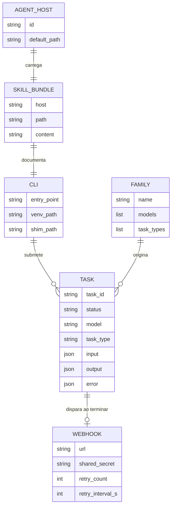
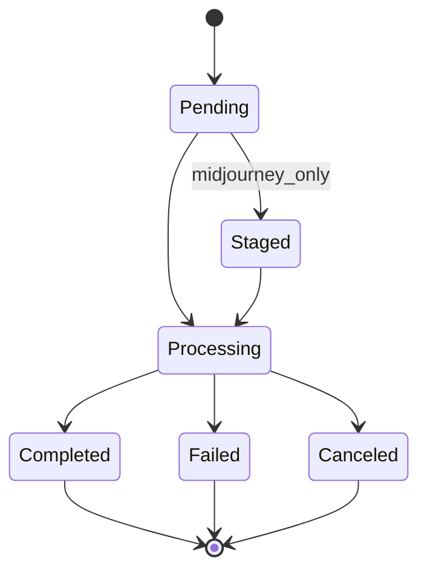

# DOMAIN — PiAPI-Skills

Glossário e modelo de entidades. Quando um termo aparecer no código (variável, classe, payload, env var), ele está aqui.

---

## Glossário

| Termo | Definição | Onde aparece |
|---|---|---|
| `Task` | Unidade async submetida via `POST /api/v1/task` à PiAPI. Tem `task_id`, `status`, `output`. | `cli/cli.py` (`_post_task`, `_get_task`, `_wait_task`) |
| `Envelope` | Body padrão da PiAPI: `{ "model": "...", "task_type": "...", "input": {...}, "config": {...} }`. | `cmd_submit`, `cmd_run`, `cmd_imagine`, `cmd_flux`, `cmd_kling`, etc. |
| `Family` | Categoria do modelo PiAPI (Midjourney, Flux, Gemini, Kling, Luma, Hailuo, Veo 3, Seedance 2, Hunyuan, Suno, MMAudio, F5-TTS, Trellis, Faceswap, LLM). | `README.md` surface map; `cmd_models` lista |
| `Status` | Estado da `Task`. Enum *muda de capitalização entre famílias* (Midjourney `Capitalized`, Flux/Kling `lowercase`). | `_normalize_status`, `TERMINAL_STATUSES`, `FAILURE_STATUSES` |
| `Terminal status` | `Completed`/`completed`, `Failed`/`failed`, `Canceled`/`canceled`. Para o `_wait_task`. | `TERMINAL_STATUSES` em `cli/cli.py` |
| `Staged` | Status da Midjourney que **NÃO é terminal**. Indica que a task está em fila de stage. `_wait_task` continua polando. | comentário em `cli/cli.py`, doc no README |
| `Webhook` | Callback que a PiAPI faz no consumidor quando a task termina. **Sem HMAC**. Autenticação por shared secret no header `x-webhook-secret`. Retry: 5s × 3. | `cmd_verify_webhook`, `verify-webhook` skill |
| `LLM gateway` | Endpoint OpenAI-compat `POST /v1/chat/completions` (separado do envelope async). | `cmd_llm`, `LLM_BASE` constant |
| `Skill` | Arquivo `SKILL.md` versionado em `agents/<host>/SKILL.md`, instalado lado a lado com a CLI. | `install.sh`, `agents/` |
| `Agent host` | Sistema AI que consome a skill (Claude Code, Codex, Hermes, OpenClaw, Cursor, Windsurf, generic). | `ALL_AGENTS` em `install.sh`, `agent_path()` |
| `Service mode` | Plano de execução da PiAPI (`fast`, `relax`, `turbo`). Passado em `config.service_mode`. | `cmd_imagine` flag `--service-mode` |
| `Shim` | Script wrapper em `~/.local/bin/piapi-cli` que ativa o venv e roda `cli.py`. | `install.sh` |
| `PIAPI_API_KEY` | Env var obrigatória. Sem ela, exit code 2. | `_key()` em `cli/cli.py` |

---

## Entidades principais

### `Task`

- **O que é:** unidade de trabalho async da PiAPI. Submete-se um envelope, recebe-se um `task_id`, polla-se até status terminal.
- **Atributos chave:** `task_id` (string), `status` (string com capitalização variável), `model`, `task_type`, `input` (dict), `output` (dict, presente após terminal), `error` (presente em failure).
- **Ciclo de vida:** `pending`/`Pending` → (`Staged` apenas Midjourney, **não-terminal**) → `processing`/`Processing` → `Completed`/`completed` | `Failed`/`failed` | `Canceled`/`canceled`.
- **Quem cria:** consumidor da CLI (`piapi-cli submit`, `imagine`, `flux`, `kling`, etc.) ou consumidor HTTP direto da PiAPI.
- **Quem consome:** o mesmo consumidor via `result`/`wait` ou via webhook entregue pela PiAPI.

### `Family`

- **O que é:** agrupamento de modelos PiAPI por capability. Cada família tem um conjunto de `task_type` válido.
- **Atributos chave:** `name` (Midjourney, Flux, …), lista de `model` IDs, lista de `task_type` suportados (`imagine`, `upscale`, `variation`, `txt2img`, `img2img`, `txt2video`, `img2video`, `lipsync`, `swap`, `tts`, `chat`).
- **Relação com `Task`:** 1:N — uma família origina muitas tasks.

### `Webhook`

- **O que é:** mensagem POST que a PiAPI envia para a URL registrada na conta quando uma task atinge status terminal.
- **Atributos chave:** body JSON (mesmo shape do `_get_task` response), header `x-webhook-secret` (string fornecida pelo usuário no painel PiAPI).
- **Regras de negócio:**
  - PiAPI **não** assina com HMAC. A verificação é shared-secret puro (`hmac.compare_digest(received, expected)`).
  - Retry: 5 segundos × 3 tentativas. Após isso, a entrega é descartada.
  - Idempotência é responsabilidade do consumidor.

### `SkillBundle`

- **O que é:** conjunto de SKILL.md (um por host) versionado em `agents/<host>/SKILL.md` no repo, instalado em paralelo pelo `install.sh`.
- **Atributos chave:** `host` (string em `ALL_AGENTS`), `path` (resolve em `agent_path()`), `content` (markdown).
- **Regras de negócio:**
  - Mesmo conteúdo conceitual em todos os hosts; ajustes mínimos de voz por host.
  - Reinstalação é idempotente (overwrite limpo).

### `AgentHost`

- **O que é:** sistema AI alvo que carrega a skill.
- **Valores:** `claude`, `codex`, `hermes`, `openclaw`, `cursor`, `windsurf`, `generic`.
- **Path resolution:**
  - `claude` → `~/.claude/skills/piapi/`
  - `codex` → `~/.codex/skills/piapi/`
  - `hermes` → `~/.hermes/skills/piapi/`
  - `openclaw` → `~/.openclaw/skills/piapi/`
  - `cursor` → `<cwd>/.cursor/skills/piapi/`
  - `windsurf` → `<cwd>/.windsurf/skills/piapi/`
  - `generic` → `~/.local/share/agent-skills/piapi/`

---

## Diagrama de entidades

---

## Regras de negócio (invariantes)

- **INV-1:** `_wait_task` só retorna quando o status está em `TERMINAL_STATUSES = {"Completed", "completed", "Failed", "failed", "Canceled", "canceled"}`. `Staged` **não** é terminal.
- **INV-2:** `_normalize_status` é case-insensitive e é o único ponto onde a comparação de status acontece.
- **INV-3:** `_key()` lê `PIAPI_API_KEY` e, se ausente, escreve para `stderr` e sai com exit code **2** (sem fallback silencioso).
- **INV-4:** Toda chamada HTTP usa header `X-API-Key: $PIAPI_API_KEY` (nunca query string).
- **INV-5:** `verify-webhook` usa `hmac.compare_digest` (constant-time). Comparação direta com `==` é proibida.
- **INV-6:** `install.sh` provisiona o venv em `$PIAPI_VENV_DIR` (default `~/.local/share/piapi-skill/venv`) e nunca instala globalmente nem em `/usr/local`.
- **INV-7:** Faceswap usa `target_index` **0-based**. Documentado na skill e no README.

---

## Estados / máquina de estado da Task

Observação: `Staged` é exclusivo da Midjourney e é **transient** — `_wait_task` continua polando.

---

## Termos do PiAPI-Skills que NÃO usamos

| Termo vetado | Usar em vez |
|---|---|
| `job` | `task` (PiAPI usa "task" oficialmente) |
| `done` (sozinho) | `terminal status` |
| `success` (como status) | `Completed`/`completed` |
| `error` (como status) | `Failed`/`failed` |
| `signed webhook` | `shared-secret webhook` (PiAPI não assina) |
| `target_index` 1-based | sempre 0-based |

---

## Histórico

| Data | Mudança | Quem |
|---|---|---|
| 2026-05-06 | Modelo derivado do release 1.0.0 | Wesley Simplicio |
| 2026-05-07 | Reescrita a partir de `cli/cli.py`, `install.sh`, README | Wesley Simplicio |
