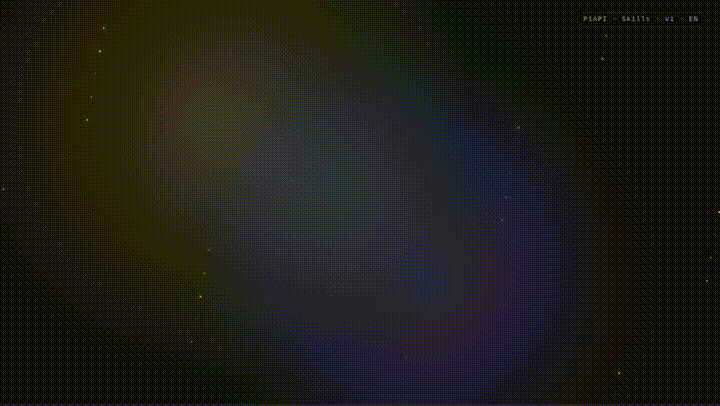
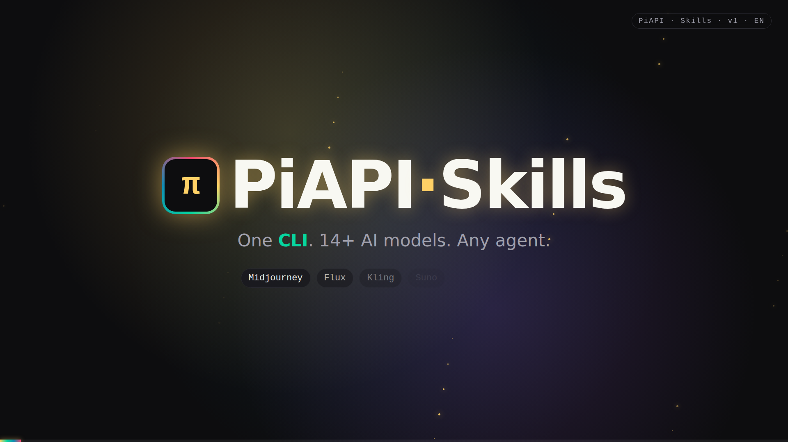
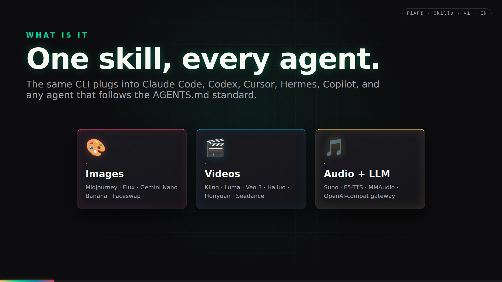
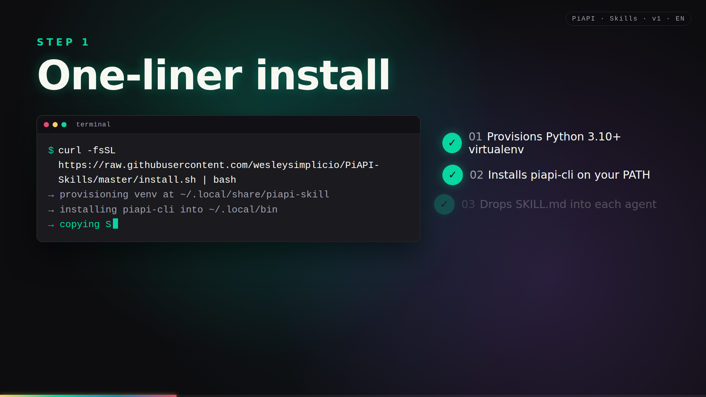
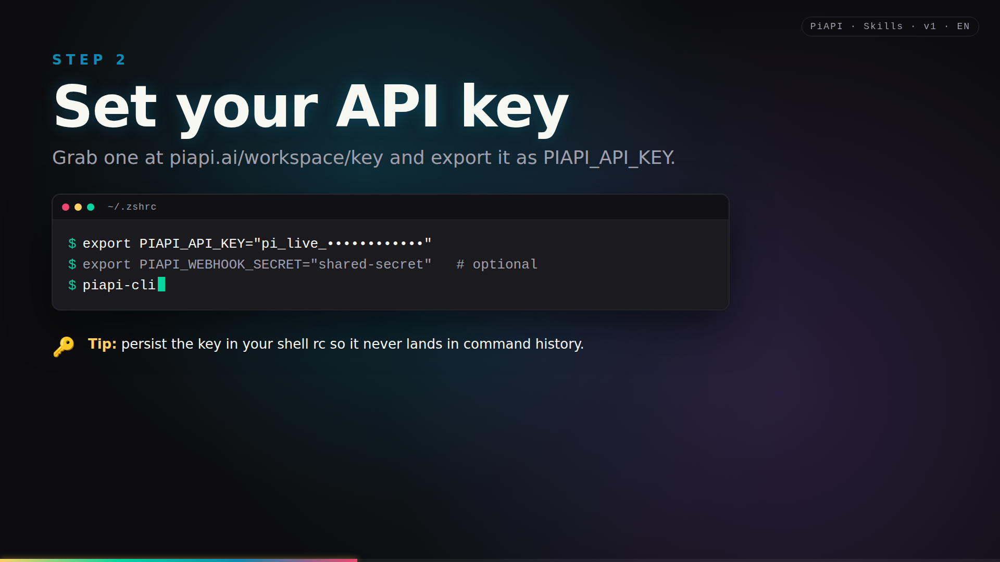
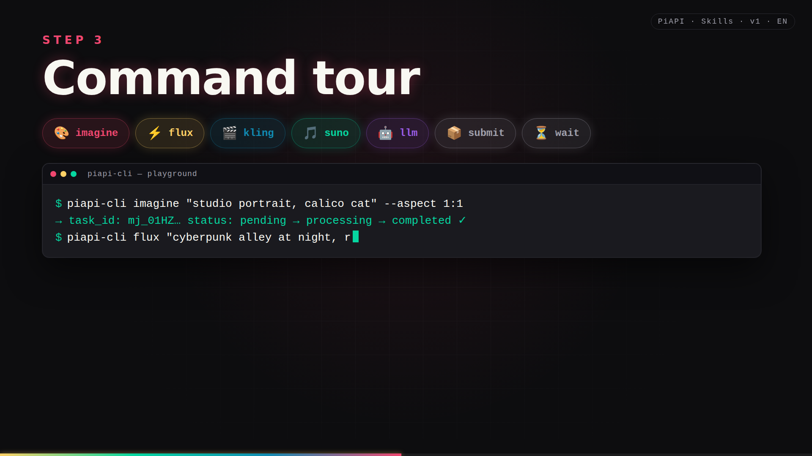
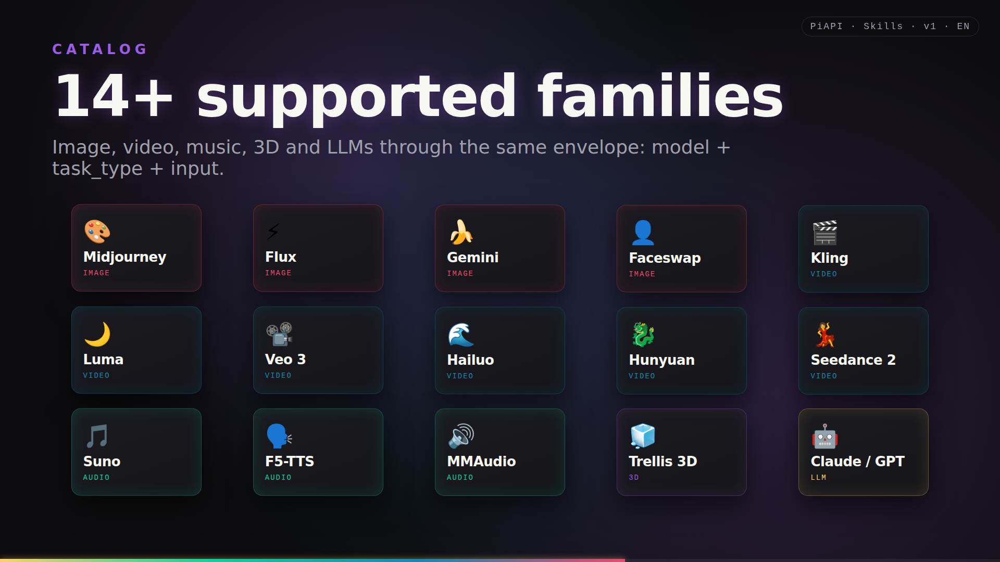
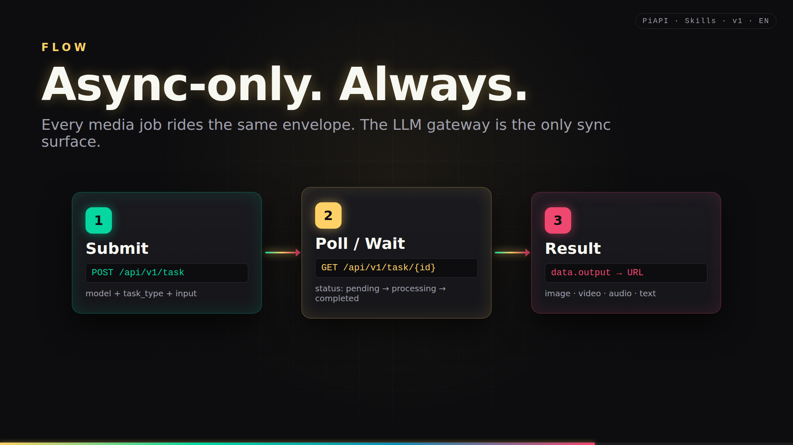
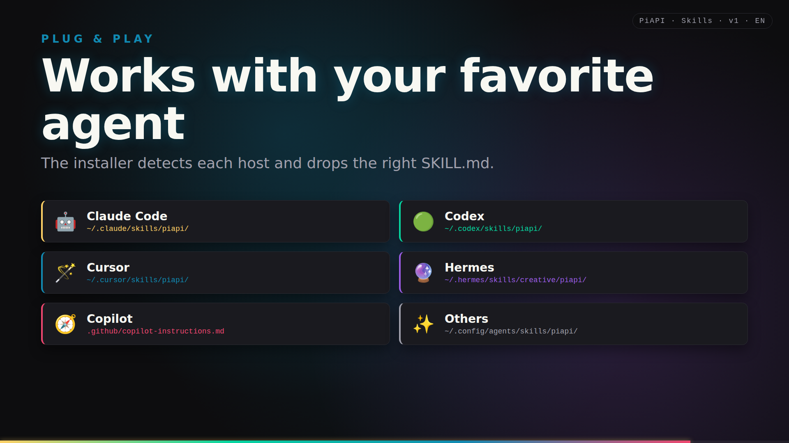
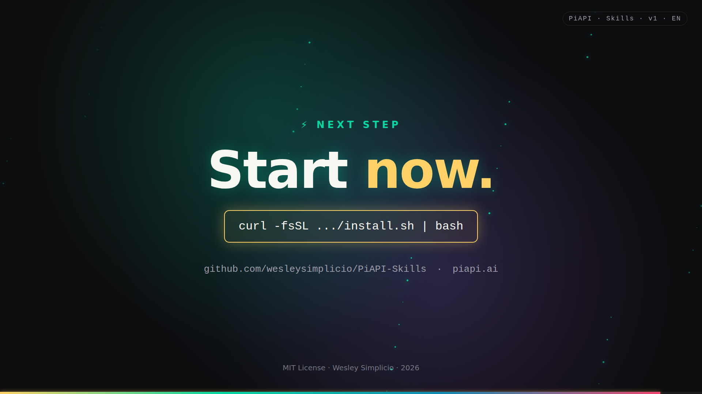

# PiAPI Skills for Claude, Codex, Hermes, OpenClaw, and others

> 🇺🇸 English. Leia em português: [README.pt-BR.md](README.pt-BR.md).


Single skill bundle that teaches AI coding agents how to drive
[PiAPI](https://piapi.ai) — Midjourney, Flux, Kling, Luma, Hailuo, Veo 3,
Suno, Hunyuan, Faceswap, Trellis 3D, MMAudio, F5-TTS, Gemini Nano Banana,
Seedance 2, plus the OpenAI-compatible LLM proxy — through one CLI.

> Not affiliated with PiAPI. "PiAPI" is a trademark of its respective owner.

## Watch the tutorial (1 min)

<p align="center">
  <a href="presentation/remotion-tutorial/media/en/tutorial.mp4">
    
  </a>
</p>

<p align="center">
  <a href="presentation/remotion-tutorial/media/en/tutorial.mp4"><b>▶︎ Full MP4</b></a>
  ·
  <a href="presentation/remotion-tutorial/media/en/cover.png">Cover</a>
  ·
  <a href="presentation/remotion-tutorial/media/en/scenes/">Per-scene stills</a>
  ·
  <a href="presentation/remotion-tutorial/">Source (Remotion)</a>
</p>

A 9-scene animated walkthrough — install, configure `PIAPI_API_KEY`, CLI
tour, model catalog, async submit/poll/result flow, and per-agent skill
paths. Built with [Remotion](https://www.remotion.dev/); edit and re-render
from `presentation/remotion-tutorial/`.

### Scene gallery

| | | |
|:-:|:-:|:-:|
| <br/>**1. Intro** | <br/>**2. What is it** | <br/>**3. Install** |
| <br/>**4. Configure** | <br/>**5. CLI tour** | <br/>**6. Models** |
| <br/>**7. Workflow** | <br/>**8. Agents** | <br/>**9. Outro** |

## Install

```bash
curl -fsSL https://raw.githubusercontent.com/wesleysimplicio/PiAPI-Skills/master/install.sh | bash
```

Or clone and run:

```bash
git clone https://github.com/wesleysimplicio/PiAPI-Skills.git
cd PiAPI-Skills
./install.sh
```

Flags:

```bash
./install.sh --yes                          # non-interactive
./install.sh --agents claude,codex,hermes   # install only listed agents
./install.sh --uninstall                    # remove CLI + agent skills
```

The installer:

1. Provisions a Python 3.10+ virtualenv at
   `~/.local/share/piapi-skill/venv` and installs `requests`.
2. Drops `piapi-cli` into `~/.local/bin` (add to `PATH` if missing).
3. Copies the appropriate `SKILL.md` into each detected agent skill root.

Agent skill paths the installer writes to:

| Agent | Path |
|---|---|
| Claude Code | `~/.claude/skills/piapi/SKILL.md` |
| Codex | `~/.codex/skills/piapi/SKILL.md` |
| Hermes | `~/.hermes/skills/creative/piapi/SKILL.md` |
| OpenClaw | `~/.openclaw/skills/piapi/SKILL.md` |
| Cursor | `~/.cursor/skills/piapi/SKILL.md` |
| Windsurf | `~/.windsurf/skills/piapi/SKILL.md` |
| Generic | `~/.config/agents/skills/piapi/SKILL.md` |

## Configure

Set the API key from https://piapi.ai/workspace/key:

```bash
export PIAPI_API_KEY="<your key>"
# optional, only if you receive webhooks:
export PIAPI_WEBHOOK_SECRET="<your shared secret>"
```

Persist in your shell rc (`~/.zshrc`, `~/.bashrc`).

## CLI tour

```bash
piapi-cli --help                                              # subcommand list
piapi-cli models                                              # list known model · task_type pairs
piapi-cli imagine "studio portrait, calico cat" --aspect 1:1  # Midjourney imagine
piapi-cli flux "cyberpunk alley at night"                     # Flux schnell txt2img
piapi-cli kling --image-url https://… --prompt "slow zoom"    # Kling image2video
piapi-cli suno --prompt "lofi piano under rain"               # Suno music
piapi-cli faceswap --target-image https://… --swap-image …   # Faceswap (image)
piapi-cli submit --model <m> --task-type <t> --input '{...}' # generic submit
piapi-cli wait <task_id>                                      # poll until terminal
piapi-cli result <task_id>                                    # fetch one snapshot
piapi-cli cancel <task_id>                                    # cancel pending only
piapi-cli run --model <m> --task-type <t> --input '{...}'    # submit + wait + print
piapi-cli llm --model gpt-4o-mini --message 'user:Hi'         # sync chat completion
piapi-cli verify-webhook --header-secret X --expected Y       # constant-time compare
```

Add `--webhook-url` and `--webhook-secret` to any submit-style command to
register a callback.

## Examples

| File | What it covers |
|---|---|
| [`examples/01-text-to-image-flux.md`](examples/01-text-to-image-flux.md) | Flux txt2img — shell, raw envelope, Python. |
| [`examples/02-midjourney-imagine-upscale.md`](examples/02-midjourney-imagine-upscale.md) | Two-step imagine + upscale, Staged status, process_mode. |
| [`examples/03-kling-image-to-video.md`](examples/03-kling-image-to-video.md) | Kling image2video / text2video / extend with mode + duration. |
| [`examples/04-suno-music.md`](examples/04-suno-music.md) | Suno generate_music + custom + extend + concat + add_lyrics. |
| [`examples/05-faceswap.md`](examples/05-faceswap.md) | Image, multi-face, video faceswap; target_index zero-based. |
| [`examples/06-hunyuan-video.md`](examples/06-hunyuan-video.md) | Hunyuan txt2video-lora + img2video-lora; LoRA URL + strength. |
| [`examples/07-llm-chat.md`](examples/07-llm-chat.md) | Sync OpenAI-compatible LLM, streaming, OpenAI SDK base_url override. |
| [`examples/08-webhooks.md`](examples/08-webhooks.md) | Flask + Express receivers, constant-time secret check, retry policy. |

## References

| File | Topic |
|---|---|
| [`references/rest-api.md`](references/rest-api.md) | Submit / fetch / cancel envelopes, headers, status drift, polling. |
| [`references/models.md`](references/models.md) | Per-family `model` + `task_type` + input keys for every supported family. |
| [`references/errors.md`](references/errors.md) | HTTP status interpretation + per-model gotchas + CLI errors. |
| [`references/webhooks.md`](references/webhooks.md) | No-HMAC verification pattern, retry policy, recovery via polling. |
| [`references/rate-limits.md`](references/rate-limits.md) | Free/Creator/Pro/Enterprise tier table + concurrency planning. |

## Surface map

| Family | `model` | Common `task_type` | Status casing |
|---|---|---|---|
| Midjourney | `midjourney` | `imagine`, `upscale`, `variation`, `inpaint`, `describe`, `blend` | Capitalized |
| Flux | `Qubico/flux1-schnell`, `Qubico/flux1-dev`, `Qubico/flux1-dev-advanced` | `txt2img`, `img2img`, `inpaint`, `controlnet-lora`, `redux-variation` | lowercase |
| Gemini | `gemini` | `nano-banana-text-to-image`, `nano-banana-edit` | lowercase |
| Kling | `kling` | `text2video`, `image2video`, `extend`, `lipsync`, `effects` | Capitalized |
| Luma | `luma` | `text2video`, `image2video`, `extend` | lowercase |
| Hailuo | `hailuo` | `text2video`, `image2video`, `subject2video` | lowercase |
| Veo 3 | `veo3` | `txt2vid`, `img2vid` | lowercase |
| Seedance 2 | `seedance` | `text-to-video`, `image-to-video` | lowercase |
| Hunyuan | `Qubico/hunyuan` | `txt2video-lora`, `img2video-lora` | lowercase |
| Suno | `music-u` | `generate_music`, `generate_music_custom`, `extend`, `concat`, `add_lyrics` | lowercase |
| MMAudio | `Qubico/mmaudio` | `video2audio` | lowercase |
| F5-TTS | `Qubico/f5-tts` | `txt2speech` | lowercase |
| Trellis | `Qubico/trellis` | `image-to-3d` | lowercase |
| Faceswap (image) | `Qubico/image-toolkit` | `face-swap`, `multi-face-swap` | Capitalized |
| Faceswap (video) | `Qubico/video-toolkit` | `face-swap` | Capitalized |
| LLM | OpenAI-style `model` (`gpt-4o-mini`, `claude-3-5-sonnet`, etc.) | n/a (sync `/v1/chat/completions`) | n/a |

## Status enum drift

Lowercase before comparing. `Staged` (Midjourney) is **not** terminal —
follow up with `upscale` / `variation`. Treat
`completed | complete | success | succeeded` as terminal-success and
`failed | failure | error | canceled | cancelled | rejected` as
terminal-failure.

## Webhooks

PiAPI does **not** sign payloads with HMAC. The secret you registered on
the task is echoed in the `x-webhook-secret` request header. Constant-time
compare against your stored secret.

Retry policy: every 5s, up to 3 attempts on any non-2xx. After three
failures, recover by polling `piapi-cli result <task_id>`.

## Contributing

PRs welcome — see [`CONTRIBUTING.md`](CONTRIBUTING.md) and the
[`CODE_OF_CONDUCT.md`](CODE_OF_CONDUCT.md).

## License

MIT — see [`LICENSE`](LICENSE) and [`NOTICE`](NOTICE) for attribution
caveats and trademark disclaimers.
