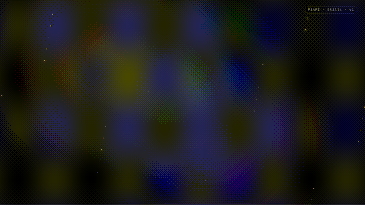

# PiAPI Skills para Claude, Codex, Hermes, OpenClaw e outros

> 🇧🇷 Versão em português. Read this in English: [README.md](README.md).

Bundle único de skills que ensina agentes de IA a operar a
[PiAPI](https://piapi.ai) — Midjourney, Flux, Kling, Luma, Hailuo, Veo 3,
Suno, Hunyuan, Faceswap, Trellis 3D, MMAudio, F5-TTS, Gemini Nano Banana,
Seedance 2, mais o proxy LLM compatível com OpenAI — através de uma única CLI.

> Sem afiliação com a PiAPI. "PiAPI" é marca do respectivo titular.

## Tutorial em vídeo (1 min)

<p align="center">
  <a href="presentation/remotion-tutorial/media/tutorial.mp4">
    
  </a>
</p>

<p align="center">
  <a href="presentation/remotion-tutorial/media/tutorial.mp4"><b>▶︎ MP4 completo</b></a>
  ·
  <a href="presentation/remotion-tutorial/media/cover.png">Capa</a>
  ·
  <a href="presentation/remotion-tutorial/">Código-fonte (Remotion)</a>
</p>

Walkthrough animado em 9 cenas — instalação, configuração da
`PIAPI_API_KEY`, tour pelo CLI, catálogo de modelos, fluxo async
submit/poll/result e caminhos de skill por agent. Feito em
[Remotion](https://www.remotion.dev/); edite e renove a partir de
`presentation/remotion-tutorial/`.

## Instalação

```bash
curl -fsSL https://raw.githubusercontent.com/wesleysimplicio/PiAPI-Skills/master/install.sh | bash
```

Ou clonar e rodar:

```bash
git clone https://github.com/wesleysimplicio/PiAPI-Skills.git
cd PiAPI-Skills
./install.sh
```

Flags:

```bash
./install.sh --yes                          # não-interativo
./install.sh --agents claude,codex,hermes   # apenas agentes listados
./install.sh --uninstall                    # remove CLI + skills
```

O instalador:

1. Provisiona venv Python 3.10+ em `~/.local/share/piapi-skill/venv` e instala `requests`.
2. Coloca `piapi-cli` em `~/.local/bin` (adicione ao `PATH` se faltar).
3. Copia o `SKILL.md` correto pra raiz de skill de cada agente detectado.

Caminhos de skill por agente:

| Agente | Caminho |
|---|---|
| Claude Code | `~/.claude/skills/piapi/SKILL.md` |
| Codex | `~/.codex/skills/piapi/SKILL.md` |
| Hermes | `~/.hermes/skills/creative/piapi/SKILL.md` |
| OpenClaw | `~/.openclaw/skills/piapi/SKILL.md` |
| Cursor | `~/.cursor/skills/piapi/SKILL.md` |
| Windsurf | `~/.windsurf/skills/piapi/SKILL.md` |
| Genérico | `~/.config/agents/skills/piapi/SKILL.md` |

## Configuração

Pegue a chave em https://piapi.ai/workspace/key:

```bash
export PIAPI_API_KEY="<sua chave>"
# opcional, só se você receber webhooks:
export PIAPI_WEBHOOK_SECRET="<seu segredo compartilhado>"
```

Persista no rc do shell (`~/.zshrc`, `~/.bashrc`).

## Tour da CLI

```bash
piapi-cli --help                                              # subcomandos
piapi-cli models                                              # pares model · task_type conhecidos
piapi-cli imagine "studio portrait, calico cat" --aspect 1:1  # Midjourney imagine
piapi-cli flux "cyberpunk alley at night"                     # Flux schnell txt2img
piapi-cli kling --image-url https://… --prompt "slow zoom"    # Kling image2video
piapi-cli suno --prompt "lofi piano under rain"               # Suno music
piapi-cli faceswap --target-image https://… --swap-image …    # Faceswap (image)
piapi-cli submit --model <m> --task-type <t> --input '{...}'  # submit genérico
piapi-cli wait <task_id>                                      # poll até estado terminal
piapi-cli result <task_id>                                    # snapshot único
piapi-cli cancel <task_id>                                    # cancelar pendente
piapi-cli run --model <m> --task-type <t> --input '{...}'     # submit + wait + print
piapi-cli llm --model gpt-4o-mini --message 'user:Hi'         # chat sync
piapi-cli verify-webhook --header-secret X --expected Y       # compare constant-time
```

Adicione `--webhook-url` e `--webhook-secret` em qualquer submit pra registrar callback.

## Exemplos

| Arquivo | O que cobre |
|---|---|
| [`examples/01-text-to-image-flux.md`](examples/01-text-to-image-flux.md) | Flux txt2img — shell, envelope cru, Python. |
| [`examples/02-midjourney-imagine-upscale.md`](examples/02-midjourney-imagine-upscale.md) | Imagine + upscale em dois passos, Staged status, process_mode. |
| [`examples/03-kling-image-to-video.md`](examples/03-kling-image-to-video.md) | Kling image2video / text2video / extend com mode + duration. |
| [`examples/04-suno-music.md`](examples/04-suno-music.md) | Suno generate_music + custom + extend + concat + add_lyrics. |
| [`examples/05-faceswap.md`](examples/05-faceswap.md) | Faceswap imagem, multi-face, vídeo; target_index zero-based. |
| [`examples/06-hunyuan-video.md`](examples/06-hunyuan-video.md) | Hunyuan txt2video-lora + img2video-lora; URL do LoRA + strength. |
| [`examples/07-llm-chat.md`](examples/07-llm-chat.md) | LLM sync compatível OpenAI, streaming, base_url do SDK. |
| [`examples/08-webhooks.md`](examples/08-webhooks.md) | Receivers Flask + Express, secret check constant-time, retries. |

## Referências

| Arquivo | Tópico |
|---|---|
| [`references/rest-api.md`](references/rest-api.md) | Submit / fetch / cancel; headers, drift de status, polling. |
| [`references/models.md`](references/models.md) | `model` + `task_type` + chaves de input por família. |
| [`references/errors.md`](references/errors.md) | Status HTTP + pegadinhas por modelo + erros de CLI. |
| [`references/webhooks.md`](references/webhooks.md) | Verificação no-HMAC, política de retry, recuperação via polling. |
| [`references/rate-limits.md`](references/rate-limits.md) | Tabela Free/Creator/Pro/Enterprise + planejamento de concorrência. |

## Mapa de superfície

| Família | `model` | `task_type` comum | Casing do status |
|---|---|---|---|
| Midjourney | `midjourney` | `imagine`, `upscale`, `variation`, `inpaint`, `describe`, `blend` | Capitalizado |
| Flux | `Qubico/flux1-schnell`, `Qubico/flux1-dev`, `Qubico/flux1-dev-advanced` | `txt2img`, `img2img`, `inpaint`, `controlnet-lora`, `redux-variation` | minúsculo |
| Gemini | `gemini` | `nano-banana-text-to-image`, `nano-banana-edit` | minúsculo |
| Kling | `kling` | `text2video`, `image2video`, `extend`, `lipsync`, `effects` | Capitalizado |
| Luma | `luma` | `text2video`, `image2video`, `extend` | minúsculo |
| Hailuo | `hailuo` | `text2video`, `image2video`, `subject2video` | minúsculo |
| Veo 3 | `veo3` | `txt2vid`, `img2vid` | minúsculo |
| Seedance 2 | `seedance` | `text-to-video`, `image-to-video` | minúsculo |
| Hunyuan | `Qubico/hunyuan` | `txt2video-lora`, `img2video-lora` | minúsculo |
| Suno | `music-u` | `generate_music`, `generate_music_custom`, `extend`, `concat`, `add_lyrics` | minúsculo |
| MMAudio | `Qubico/mmaudio` | `video2audio` | minúsculo |
| F5-TTS | `Qubico/f5-tts` | `txt2speech` | minúsculo |
| Trellis | `Qubico/trellis` | `image-to-3d` | minúsculo |
| Faceswap (image) | `Qubico/image-toolkit` | `face-swap`, `multi-face-swap` | Capitalizado |
| Faceswap (video) | `Qubico/video-toolkit` | `face-swap` | Capitalizado |
| LLM | `model` estilo OpenAI (`gpt-4o-mini`, `claude-3-5-sonnet`, etc.) | n/a (sync `/v1/chat/completions`) | n/a |

## Drift do enum de status

Lowercase antes de comparar. `Staged` (Midjourney) **não** é terminal —
chame `upscale` / `variation` em seguida. Trate
`completed | complete | success | succeeded` como sucesso terminal e
`failed | failure | error | canceled | cancelled | rejected` como falha terminal.

## Webhooks

PiAPI **não** assina payload com HMAC. O secret registrado na task é
ecoado no header `x-webhook-secret`. Faça compare constant-time contra o
secret armazenado.

Política de retry: a cada 5s, até 3 tentativas em qualquer não-2xx.
Após 3 falhas, recupere via polling `piapi-cli result <task_id>`.

## Contribuindo

PRs bem-vindos — veja [`CONTRIBUTING.md`](CONTRIBUTING.md) e
[`CODE_OF_CONDUCT.md`](CODE_OF_CONDUCT.md).

## Licença

MIT — veja [`LICENSE`](LICENSE) e [`NOTICE`](NOTICE) pra ressalvas
de atribuição e marcas registradas.
